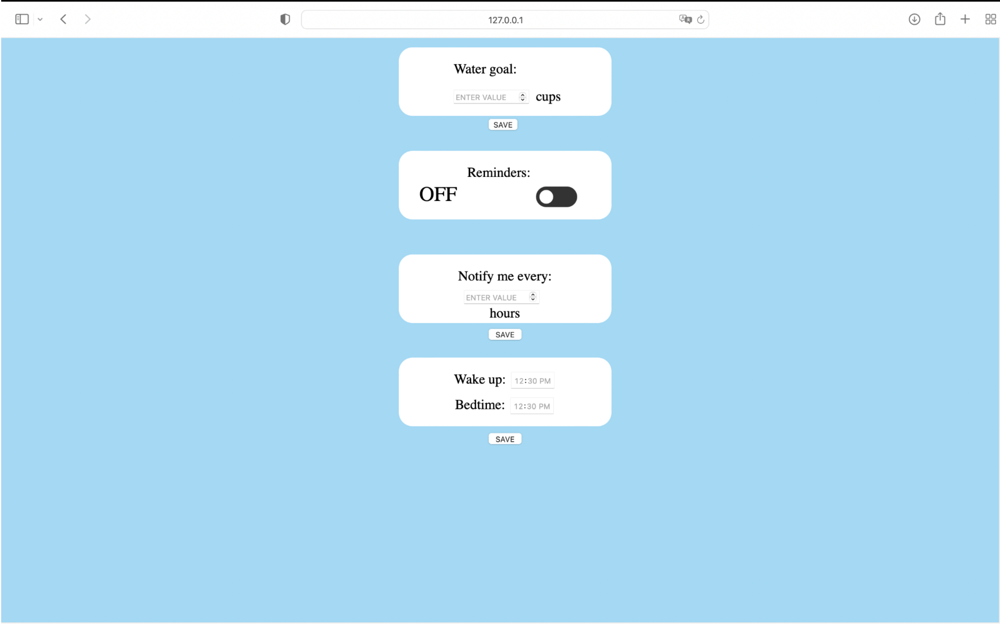

# Drinking Water WebApp

An full-stack web application that reminds individuals to drink water periodically throughout the day.

## Project Description

This web application was developed to motivate individuals (and ourselves) to stay hydrated  throughout the day in order to live a healthier lifestyle. Through creative elements such as streaks and differently animated flowers, we tried to gameify the experience to encourage people to drink more water. Individuals are able to create accounts and all of their data is saved and managed by Google Firebase. 

**Technologies Used**: JavaScript, HTML, CSS, Django, Google Firebase

*Screenshots from demo:*

## How to Run:

Use this [documentation](documentation.txt) for reference

## Contributors

This project was developed by a team of (high school) student researchers at the University of Alberta consisting of Fogil Zheng, Yoyo Liu, Ahmed Nasr, and Divya Prasad with valuable assistance from Emma Ngo. We worked under Dr. Matt Taylor and Dr. Christabel Wayllace in the Alberta Machine Intelligence Institute (Amii).
